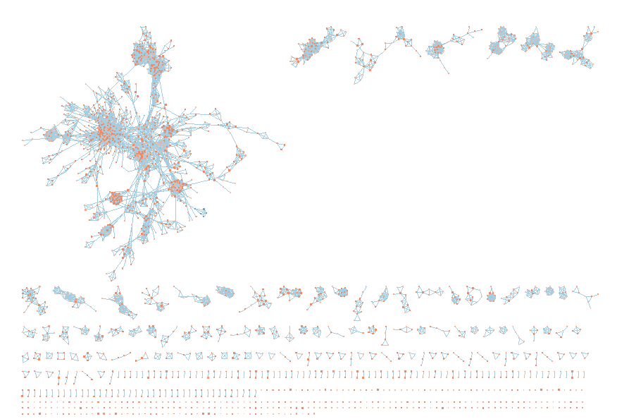
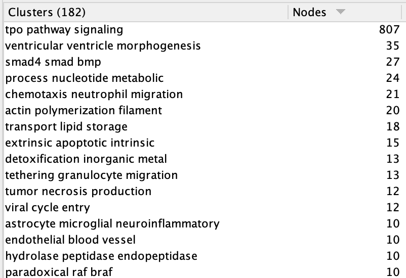

# Introduction

Down Syndrome (DS) is chracterized by the triplication of chromosome 21. It is a genetically complex condition that affects about 1 in every 700 live births, and is associated with cognitive impairment alogside a number of other abnormalities. Alzhemier's Disease pathology, generally onset around the mid 30s, is universal among DS individuals. Alldred et al. performed bulk RNA Seq of layer 3 (L3) and 5 (L5) pyramidal neurons of individuals with Down Syndrome (DS) compared to control brains to investigate the connection between DS and AD pathology [@article1].

In the first assignment for BCB 420, I [cleaned and normalized](https://github.com/bcb420-2025/Clare_Gillis/blob/main/A1_ClareGillis/ClareGillis_html.html) the RNASeq dataset created by Alldred et al. which is available at GEO accession [GSE251939](https://www.ncbi.nlm.nih.gov/geo/query/acc.cgi?acc=GSE251939). Duplicate genes were removed, technical replicates were combined, each gene was mapped to a HUGO gene symbol, and the dataset was normalized using CMM and TMM. The resulting expression dataset covers 18027 genes. In the second assignment, I performed a [differential gene expression and over representation analysis](https://github.com/bcb420-2025/Clare_Gillis/blob/main/Clare_Gillis_A2/A2_Clare_Gillis.html) of the cleaned RNASeq data. This highlighted upregulation in genes associated with apoptosis and immune dysregulation. 

Below, I outline a Gene Set Enrichment Analysis (GSEA) of the expression data created in [Assignment 2](https://github.com/bcb420-2025/Clare_Gillis/blob/main/Clare_Gillis_A2/A2_Clare_Gillis.html) and visualization of the resulting network in Cytoscape [@cytoscape], annotated using AutoAnnotate [@autoannotate]. I also show a dark matter analysis of the

We will begin by importing the necessary packages for our analysis. We will use RCurl perform a GSEA, GSA to read in gene sets, biomaRt to extract information about genes from ensembl, and ComplexHeatmap, circlize, and ggplot2 to visualize the results of our dark matter analysis.
```{r message=FALSE, warning=FALSE, results='hide'}
# ==================
# Install Required Packages
# ==================
if (!requireNamespace("BiocManager", quietly = TRUE))
  install.packages("BiocManager")


if (!requireNamespace("biomaRt", quietly = TRUE)) {
  BiocManager::install("biomaRt")
}

if (!requireNamespace("ComplexHeatmap", quietly = TRUE)){
  install.packages("ComplexHeatmap")
}

if (!requireNamespace("circlize", quietly = TRUE)){
  install.packages("circlize")
}

if (!requireNamespace("ggplot2", quietly = TRUE)){
  install.packages("ggplot2")
}

if (!requireNamespace("RCurl", quietly = TRUE)){
  install.packages("RCurl")
}

if (!requireNamespace("GSA", quietly = TRUE)){
  install.packages("GSA")
}

library(GSA)
library(ggplot2)
library(circlize)
library(ComplexHeatmap)
library(knitr)
library(biomaRt)
library(RCurl)
library(RCy3)
library(httr)
```

# Non-thresholded Gene set Enrichment Analysis

We began by running a gene set enrichment analysis using RCurl. We used the
non-thresholded ranking of all significantly enriched genes from A2 and searched
against the most recent release of the human pathway definition dataset from the
Bader Lab. From this search, we got a variety of results, and we extracted the 
pathway hits and their scores from "gsea_report" spreadsheets. We then extracted 
only the significant hits based on the commonly accepted FDR threshold of 0.05.

```{r message=FALSE, warning=FALSE}
# ==================
# Perform GSEA
# ==================

# Set initial variables
gsea_jar <- paste0(getwd(), "/GSEA_4.3.3/gsea-cli.sh")
working_dir <- getwd()
output_dir <- paste0(getwd(), "/output")
analysis_name <- "DS_vs_CTR"
rnk_file <- "DS_vs_CTR_ranked_genelist.rnk"
run_gsea <- TRUE
dest_gmt_file = ""

# Download the latest file containing human pathway definitions
if(dest_gmt_file == ""){
  # Location of the pathway file
  gmt_url <- "http://download.baderlab.org/EM_Genesets/current_release/Human/symbol/"
  
  #list all the files on the server
  filenames <- RCurl::getURL(gmt_url)
  tc <- textConnection(filenames)
  contents <- readLines(tc)
  close(tc)
  
  # get the gmt that has all pathways not inferred from electronic annotations(IEA)
  rx <- gregexpr("(?<=<a href=\")(.*.GOBP_AllPathways_noPFOCR_no_GO_iea.*.)(.gmt)(?=\">)",
    contents, perl = TRUE)
  gmt_file <- unlist(regmatches(contents, rx))
  
  dest_gmt_file <- file.path(output_dir,gmt_file )
  
  #check if this gmt file already exists
  if(!file.exists(dest_gmt_file)){
    download.file(
      paste(gmt_url, gmt_file, sep = ""),
      destfile = dest_gmt_file
    )
  }
}

# Check if GSEA has already been run, and if not, run it

#get all the GSEA directories
gsea_directories <- list.files(
  path = file.path(getwd(),"output"), 
  pattern = "\\.GseaPreranked"
  )

if (length(gsea_directories) == 0 & run_gsea){
  
  # Run the GSEA and save the results at output_dir
  command <- paste("",gsea_jar,  
                   "GSEAPreRanked -gmx", dest_gmt_file, 
                   "-rnk" ,file.path(working_dir,rnk_file), 
                   "-collapse false -nperm 1000 -scoring_scheme weighted", 
                   "-rpt_label ", analysis_name,
                   "  -plot_top_x 20 -rnd_seed 12345  -set_max 200",  
                   " -set_min 15 -zip_report false ",
                   " -out", output_dir, 
                   " > gsea_output.txt",sep = " ")
  suppressWarnings(system(command))
}

```

```{r message=FALSE, warning=FALSE}
# ==================
# Extract GSEA results
# ==================

# Get the GSEA results files (na_pos and na_neg spreadsheets)

# Exract the result files from the first gsea dir
gsea_dir <- file.path(getwd(),"output", gsea_directories[1])

# Start by getting the report file
gsea_results_files <- list.files(
  path = gsea_dir,
  pattern = "gsea_report_*.*.tsv")

# Read both result files
enr_file1 <- read.table(
  file.path(gsea_dir, gsea_results_files[1]),
  header = TRUE, 
  sep = "\t", 
  quote="\"",
  stringsAsFactors = FALSE,
  row.names=1)

enr_file2 <-read.table(
  file.path(gsea_dir, gsea_results_files[2]),
  header = TRUE, 
  sep = "\t", 
  quote = "\"",
  stringsAsFactors = FALSE,
  row.names = 1)

# Combine na_pos and na_neg files and get the significant hits (threshold of 0.05)
gsea_results <- rbind(enr_file1, enr_file2)
gsea_signficant <- subset(gsea_results, FDR.q.val < 0.05)

print(paste("Total number of pathway results from GSEA:", nrow(gsea_results)))
print(paste("Number of significant pathway results from GSEA:", nrow(gsea_signficant)))
```

# Visualization in Cytoscape

We next used Cytoscape [@cytoscape] to visualize our GSEA data as a network where nodes are significant 
pathways identified by the GSEA and edges are connections between similar pathways, 
then clustered it by term name. 

We imported our GSEA result files and filtered nodes by q-value <= 0.05 (commonly
accepted significance threshold,) and an edge cutoff of 0.375 (default.) This 
left a network of 2637 nodes and 10828 edges shown 
in Figure 1.

We then annotated the network using AutoAnnotate [@autoannotate] with the following
parameters: amount of clusters 1/3 of the way between fewer/smaller and more/larger
(our network contained many genes, so we wanted them to cluster to relatively few
groups, making the figure more readable), unchecked sigleton clusters, 
unchecked minimize cluster overlap, used WordCloud with most frequent words in 
cluster and adjacent words (we wanted to cluster pathways with similar meanings,
not only identical words in their name), label column Name, max words per 
label = 3 (default,) minimum word occurance = 1 (default,) and adjacent word
bonus = 8 (default.) This annotation produced Figure 2.

A summary of the top 16 clusters, ordered by size, can be found in Figure 3.



<br />


<br />



<br />

As mentioned in assignment 2, the pathways we have previously identified through thresholded over-representation analysis of this gene set are all associated with apoptosis and the immune system. However, by far the largest cluster in this network, with 807 genes, is associated with TPO pathway signaling. This is not entirely unusual since, although the pathway was not specifically mentioned  by Alldred et al. [@article1], they found evidence of alterations to normal physiologcal processes, which TPO signaling is [@tpo]. As expected, though, clusters associated with apoptosis (ex. "extrinsic apoptotic intrinsic") and the immune system (ex "chemotaxis neutrophil migration") are apparent.

# Dark Matter Analysis

The information we have gathered about the pathways our significantly enriched genes are involved in all comes from genes pathways available in the literature - but there are many genes and pathways that have yet to be fully explored. We performed a dark matter analysis to identify significantly expressed genes in our dataset that were not annotated to any of the pathways returned in the enrichment analysis, and ones not annotated to any pathways in entire set of pathways used for the analysis. We then displayed heatmaps of the expression for each of these sets (Figures 4 & 5.)

```{r message=FALSE, warning=FALSE}
# ==================
# Perform Dark Matter Analysis
# ==================

# Read in the definitions of all the gene sets in the gmt file we searched
# against in the GSEA
invisible(
  capture.output(
    genesets <- GSA.read.gmt(dest_gmt_file), type = "output")
  )
names(genesets$genesets) <- genesets$geneset.names

# Read in the overexpression data and get the significantly expressed genes
expression <- read.table(
  file.path(working_dir, "diff_expr_data.txt"),
  header = TRUE, 
  sep = '\t', 
  quote = "\"", 
  stringsAsFactors = FALSE
  )
sig_genes <- expression[expression$FDR < 0.05, ]

# Read in the list of ranked genes
ranks <- read.table(
  file.path(working_dir, rnk_file), 
  header = TRUE, 
  sep = '\t', 
  quote = "\"", 
  stringsAsFactors = FALSE
  )

# GSEA results files - the na_pos and na_neg spreadsheets in GSEA results directories

# Get the genes in the genesets from the GSEA results
all_enr_genesets<- c(rownames(enr_file1), rownames(enr_file2))
genes_enr_gs <- c()

for(i in 1:length(all_enr_genesets)){
  current_geneset <- unlist(
    genesets$genesets[which(genesets$geneset.names %in% all_enr_genesets[i])])
  genes_enr_gs <- union(genes_enr_gs, current_geneset)
}

# Get the genes from the significant genesets from the GSEA results

FDR_threshold <- 0.05 # significance threshold

# Get significantly enriched genesets
all_sig_enr_genesets<- c(rownames(enr_file1)[
  which(enr_file1[,"FDR.q.val"] <= FDR_threshold)],
  rownames(enr_file2)[which(enr_file2[,"FDR.q.val"] <= FDR_threshold)])

# Get genes from significant genesets
genes_sig_enr_gs <- c()

for(i in 1:length(all_sig_enr_genesets)){
  current_geneset <- unlist(genesets$genesets[
    which(genesets$geneset.names %in% all_sig_enr_genesets[i])])
  genes_sig_enr_gs <- union(genes_sig_enr_gs, current_geneset)
}

# All genes in geneset file
genes_all_gs <- unique(unlist(genesets$genesets))

# Get genes with no annotation
genes_no_annotation <- setdiff(sig_genes[,1], genes_all_gs)
genes_no_annotation_sig_enr <- setdiff(sig_genes[,1], genes_sig_enr_gs)

# Output results
print(paste("Total number of genes in the geneset search file: ",length(genes_all_gs)))
print(paste("Number of significantly expressed genes in our dataset not annotated to any of the pathways returned in the enrichment analysis: ",length(genes_no_annotation_sig_enr)))
print(paste("Number of significantly expressed genes in our dataset not annotated to any pathways in entire set of pathways used for the analysis: ",length(genes_no_annotation)))
```

```{r message=FALSE, warning=FALSE}
# ==================
# Get the expresssion matrices for the two dark matter genesets
# ==================

# Read in the cleaned counts and get a matrix for each of the dark matter genesets
expressionMatrix <- as.matrix(read.table(file.path(getwd(), "normalized_filtered_RSEM_counts.txt"),
                                header = TRUE,  
                                sep = "\t",     
                                quote = "",     
                                check.names = FALSE))

# Get scales enrichment matrices for each of the dark matter genesets

sig_gene_expr_no_sig_enr <- t(
  scale(
    t(expressionMatrix[rownames(expressionMatrix) %in% genes_no_annotation_sig_enr, ])
  )
)

sig_gene_expr_no_annotations <- t(
  scale(
    t(expressionMatrix[rownames(expressionMatrix) %in% genes_no_annotation, ])
  )
)
```

```{r fig.width=14, fig.height=10, message=FALSE, warning=FALSE}
# ==================
# Display a heatmap of significant genes not annotated to any of the pathways 
# returned in the enrichment analysis
# ==================

# Calculate 5th and 95th percentiles
percentile_5 <- quantile(sig_gene_expr_no_sig_enr, 0.05)
percentile_95 <- quantile(sig_gene_expr_no_sig_enr, 0.95)

# Define color scale based on percentiles
if (percentile_5 == 0) {
  heatmap_col <- circlize::colorRamp2(c(percentile_5, percentile_95),
                                      c("white", "red"))
} else {
  heatmap_col <- circlize::colorRamp2(c(percentile_5, 0, percentile_95),
                                       c("blue", "white", "red"))
}

# Add annotations to the heatmap to show data clustering

sample_type_dt <- read.table(
  file.path(working_dir, "sample_types.txt"),
  header = TRUE, 
  sep = '\t', 
  quote = "\"", 
  stringsAsFactors = FALSE,
  row.names = 1
  )

# Assign a color to each sample
unique_samples <- unique(sample_type_dt$sampleID)
unique_sample_colors <- rainbow(n = length(unique_samples))
names(unique_sample_colors) <- unique_samples

# Assign a color to each diagnosis
unique_diagnosis <- unique(sample_type_dt$diagnosis)
unique_diagnosis_colors <- rainbow(n = length(unique_diagnosis))
names(unique_diagnosis_colors) <- unique_diagnosis

# Assign a color to each layer
unique_layer <- unique(sample_type_dt$layer)
unique_layer_colors <- rainbow(n = length(unique_layer))
names(unique_layer_colors) <- unique_layer

# Create an annotation to color code each column by sample, diagnosis, and layer
ha_pat <- ComplexHeatmap::HeatmapAnnotation(
  df = data.frame(
  samples = sample_type_dt$sampleID,
  diagnosis = sample_type_dt$diagnosis,
  layer = sample_type_dt$layer),
  col = list(
    samples = unique_sample_colors,
    diagnosis = unique_diagnosis_colors,
    layer = unique_layer_colors),
  show_legend = TRUE)

# Create a color coded heatmap of the differential expression data, clustered
# as much as possible
heatmap <- ComplexHeatmap::Heatmap(
  as.matrix(sig_gene_expr_no_sig_enr),
  top_annotation = ha_pat,
  cluster_rows = TRUE,
  cluster_columns = TRUE,
  show_row_dend = TRUE,
  show_column_dend = TRUE,
  col = heatmap_col,
  show_column_names = TRUE,
  show_row_names = FALSE,
  show_heatmap_legend = TRUE,
  use_raster = TRUE,
  column_title = ("Significantly differentially expressed genes in DS vs CTR that are not annotated to any of the pathways returned in the enrichment analysis"),)

# Display the heatmap
heatmap
```
*Figure 4: Heat map of differential gene expression for genes not annotated to any of the pathways returned in the enrichment analysis. Gene expression is shown on a scale from blue (heavily downregulated) to red (heavily upregulated.) The ends of the expression color spectrum are the 5th and 95th percentile expression levels. Genes and samples are clustered. Each column is color coded by sample, diagnosis, and cell layer (see the legend on the right.) *

```{r fig.width=14, fig.height=10, message=FALSE, warning=FALSE}
# ==================
# Display a heatmap of significant genes not annotated to any pathways in entire 
# set of pathways used for the analysis
# ==================

# Calculate 5th and 95th percentiles
percentile_5 <- quantile(sig_gene_expr_no_annotations, 0.05)
percentile_95 <- quantile(sig_gene_expr_no_annotations, 0.95)

# Define color scale based on percentiles
if (percentile_5 == 0) {
  heatmap_col <- circlize::colorRamp2(c(percentile_5, percentile_95),
                                      c("white", "red"))
} else {
  heatmap_col <- circlize::colorRamp2(c(percentile_5, 0, percentile_95),
                                       c("blue", "white", "red"))
}

# Add annotations to the heatmap to show data clustering

sample_type_dt <- read.table(
  file.path(working_dir, "sample_types.txt"),
  header = TRUE, 
  sep = '\t', 
  quote = "\"", 
  stringsAsFactors = FALSE,
  row.names = 1
  )

# Assign a color to each sample
unique_samples <- unique(sample_type_dt$sampleID)
unique_sample_colors <- rainbow(n = length(unique_samples))
names(unique_sample_colors) <- unique_samples

# Assign a color to each diagnosis
unique_diagnosis <- unique(sample_type_dt$diagnosis)
unique_diagnosis_colors <- rainbow(n = length(unique_diagnosis))
names(unique_diagnosis_colors) <- unique_diagnosis

# Assign a color to each layer
unique_layer <- unique(sample_type_dt$layer)
unique_layer_colors <- rainbow(n = length(unique_layer))
names(unique_layer_colors) <- unique_layer

# Create an annotation to color code each column by sample, diagnosis, and layer
ha_pat <- ComplexHeatmap::HeatmapAnnotation(
  df = data.frame(
  samples = sample_type_dt$sampleID,
  diagnosis = sample_type_dt$diagnosis,
  layer = sample_type_dt$layer),
  col = list(
    samples = unique_sample_colors,
    diagnosis = unique_diagnosis_colors,
    layer = unique_layer_colors),
  show_legend = TRUE)

# Create a color coded heatmap of the differential expression data, clustered
# as much as possible
heatmap <- ComplexHeatmap::Heatmap(
  as.matrix(sig_gene_expr_no_annotations),
  top_annotation = ha_pat,
  cluster_rows = TRUE,
  cluster_columns = TRUE,
  show_row_dend = TRUE,
  show_column_dend = TRUE,
  col = heatmap_col,
  show_column_names = TRUE,
  show_row_names = FALSE,
  show_heatmap_legend = TRUE,
  use_raster = TRUE,
  column_title = ("Significantly differentially expressed genes in DS vs CTR that are not annotated to any pathways in entire set of pathways used for the analysis"),)

# Display the heatmap
heatmap
```
*Figure 5: Heat map of differential gene expression for genes not annotated to any pathways in entire set of pathways used for the analysis. Gene expression is shown on a scale from blue (heavily downregulated) to red (heavily upregulated.) The ends of the expression color spectrum are the 5th and 95th percentile expression levels. Genes and samples are clustered. Each column is color coded by sample, diagnosis, and cell layer (see the legend on the right.) *

<br />

The expression data for both of the dark matter genesets does not cluster very well by layer, but the expression data for genes not annotated to any of the pathways returned in the enrichment analysis clusters fairly well by diagnosis. Moreover, the expression data for genes not annotated to any pathways in entire set of pathways used for the analysis clusters perfectly by diagnosis. This is to be expected since DS is caused by the triplication of chromosome 21, likely leading to overexpression of the genes on this chromosome. To invesitgate this further, we performed an over representation analysis of chromosomes in the set of genes not annotated to any of the pathways returned in the enrichment analysis (and only this set since the set of genes not annotated to any pathways in entire set of pathways used for the analysis is a subset of these.) We produced a bar chart displaying the number of genes in the unannotated set per chromosome normalized by the size of each chromosome according to Makałowski [@chromosome_sizes]. (Figure 6.) As expected, chromosome 21 is significantly overrepresented in the unannotated gene set. Interestingly, however, other chromosomes are significanlty represented (ex. chromosome 19) indicating potential interplay between chromosome 21 and other chromosomes. This link should be studied further.

```{r message=FALSE, warning=FALSE}
# ==================
# Perform over-representation analysis of chromosomes
# ==================

# Search ensembl for the chromosome number of each of the unannotated genes
ensembl <- biomaRt::useMart("ensembl", dataset = "hsapiens_gene_ensembl")
gene_info <- biomaRt::getBM(attributes = c("hgnc_symbol", "chromosome_name"),
                   filters = "hgnc_symbol", 
                   values = genes_no_annotation_sig_enr, 
                   mart = ensembl)

# Reformat chromosome names to get chromosome number only
gene_info$chromosome_name <- gsub("^HSCHR", "", gene_info$chromosome_name)
gene_info$chromosome_name <- gsub("_.*", "", gene_info$chromosome_name)
gene_info <- gene_info[!grepl("^HG", gene_info$chromosome_name), ]
                   
# Get frequency of each chromosome
chromosome_count <- table(gene_info$chromosome_name)
chromosome_count_df <- as.data.frame(chromosome_count)
colnames(chromosome_count_df) <- c("chromosome_name", "Freq")

# Get frequency / size of the chromosome
chromosome_sizes <- data.frame(
  c(as.character(1:22), "X", "Y"),
  c(249, 237, 192, 183, 174, 165, 153, 135, 132, 132, 132, 123, 108, 105, 99, 
    84, 81, 75, 69, 63, 54, 57, 141, 60)
)
colnames(chromosome_sizes) <- c("chromosome_name", "Size")

chromosome_count_df <- merge(
  chromosome_count_df, 
  chromosome_sizes, 
  by = "chromosome_name", 
  all.x = TRUE)

# Normalize chromosome frequency by size
chromosome_count_df$norm_freq <- chromosome_count_df$Freq / chromosome_count_df$Size

# Sort the chromosome proportions in descending order
chromosome_count_df$chromosome_name <- factor(
  chromosome_count_df$chromosome_name, 
  levels = chromosome_count_df$chromosome_name[
    order(chromosome_count_df$norm_freq, decreasing = TRUE)])

# Display the frequency as a bar plot
ggplot2::ggplot(chromosome_count_df, aes(x = chromosome_name, y = norm_freq)) +
  geom_bar(stat = "identity", fill = "lightblue", color = "blue") +
  labs(
    title = "Chromosome frequency for unannotated genes normalized by chromosome size",
    x = "Chromosome",
    y = "Chromosome frequency / chromosome size (Mbp)"
  ) +
  theme_minimal() +
  theme(
    axis.text.x = element_text(angle = 45, hjust = 1),
    axis.text = element_text(size = 12),
    plot.title = element_text(hjust = 0.5),
    axis.title = element_text(size = 14)
  )

```

*Figure 6: Bar chart of chromosome frequency for genes not annotated to any of the pathways returned in the enrichment analysis. Each bar represents the frequency of a particular chromosome in the geneset divided by the size of the chromosome in Mbp.*

# Interpretation

## GSEA and Cytoscape

Through their analysis of the expression data they collected from brains of individials with DS and from control brains, Alldred et al. found upregulation in stress-response pathways including neuroinflammation signaling [@article1]. While our thresholded over representation analysis from assignment two did not find significant differential expression in stress response pathways, our GSEA analysis and clustering by AutoAnnotate [@autoannotate] on Cytoscape [@cytoscape] found upregulation in multiple terms involved in stress response pathways. Within our top 16 clusters, shown in Figure 3, these include "detoxification inorganic metal," "tumor necrosis production," "astrocyte microglial neuroinflammatory." The link between down syndrome and upregulation in stress response pathways is well studied, notably in conjunction with AD pathology [@stress].

Alldred et al. also found downregulation in genes related to apoptosis [@article1]. In both our analysis outlined here and our analysis in assignment 2, we found the opposite - upregulation in genes and pathways associated with apoptosis (ex. extrinsic apoptotic intrinsic.) A study by Seidl et al. found elevated levels of an apoptosis related protein in the brains of DS individuals, supporting the upregulation we found [@ds_apo_fas; @apo_fas]. Similarily, Alldred et al. found downregulation in recycling and cellular processing pathways [@article1], but through our GSEA and AutoAnnotation clustering, we found upregulation in these terms. This includes the clusters "process nucleotide metabolic," "transport lipid storage," and "hydrolase peptidase endopeptidase." Endosome dysregulation is associated with DS individuals, particularly those with AD pathology [@endo1; @endo2]. Various studies have found upregulation and downregulation of genes related to endocytosis, so our results and those of Alldred et al. are not contradictory. The inconsistency may arise from differences in analytic methods and support dysregulation of apoptotic, recycling, and cellular processing pathways rather than pure up- or down-regualtion.

As with our analysis in assignment 2, the analysis outlined above found up-regulation in immune system related pathways although this was not mentioned by Alldred et al [@article1]. These include "chemotaxis neutrophil migration," "tethering granulocyte migration," and "viral cycle entry." There is a well studied link between DS and immune dysregulation, so these terms are not unexpected [@imm1; @imm2]. 

Finally, we found significant differential expression in many genes related to pathways involved in normal physiological processes, which is completely consistent with Alldred et al [@article1]. Of our top 16 clusters, these include "top pathway signaling," "ventricular ventricle morphogenisis," "smad4 smad bmp" (smad4 is a gene related to normal cell growth [@SMAD4],) "actin polymerization filament," "endothelial blood vessel, and "paradoxical raf braf" (RAF and BRAF are part of the MAPK pathway [@RAF; @BRAF].)
 
## Dark Matter analysis

Alongside our GSEA and visualization using Cytoscape [@cytoscape], we investigated the dark matter within our dataset. We found many significantly expressed genes in our dataset that were not annotated to pathways returned from our GSEA, and that were not annotated to any pathways used in our GSEA. These genes were primarily upregulated in DS samples compared to controls, so we suspected that they were genes from the triplicated chromosome 21. To assess this, we plotted the frequency of each chromosome in the dark matter dataset normalized by chromsome size and found that chromosome 21 was, in fact, significantly overrepresented. However, given the overrepresentation of other chromosomes like chromosome 19, it would be interesting to investigate the effects of DS on specifically non-chromosome-21 genes.


# Discussion

### [Do the enrichment results support conclusions or mechanism discussed in the original paper?](#gsea-and-cytoscape)

For the most part, yes. Although we have found overexpression of pathways Alldred et al. found were underexpressed, our analyses are consistent in finding that stress response pathways, apoptotic pathways, recycling and cellular processing pathways, and normal physiological process pathways are differentially expressed. The only theme we found that was not directly highlighted by Alldred et al. is immune dysregulation.


### [How do these results differ from the results you got from Assignment #2 thresholded methods?](#gsea-and-cytoscape)

Our analysis from assignment 2 identified very few pathways, all of which were associated with apoptosis or immune dysregualtion. These results also highlighted apoptosis and immune related pathways, alongside far more significant pathways. 


### [Can you find evidence, i.e. publications, to support some of the results that you see. How does this evidence support your result?](#gsea-and-cytoscape)

There are publications that support all of the results we see. These are highlighted in the Interpretation section.

# References

[[END]]
